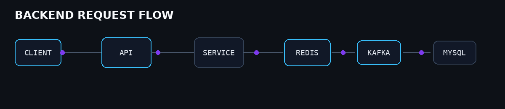

<div align="center">


[](https://github.com/VijayDommaraju)
[](https://www.linkedin.com/in/vijayvarmand/)
[](mailto:vijaydommaraju111@gmail.com)

</div>

---

## 👋 About Me

I'm a **Java Backend Developer** focused on building secure, scalable and maintainable backend systems.

My primary stack is **Java + Spring Boot + Spring Security + JPA/Hibernate + MySQL**, with a growing focus on **Redis, Kafka, Docker, microservices and system design**.

I enjoy working beyond individual endpoints — understanding **architecture, transactions, concurrency, caching, messaging, performance, deployment and observability**.

---

## ⚡ Currently Focused On

<div align="center">


</div>

---

## 🧠 Engineering Mindset

```text
Requirement
    ↓
Architecture
    ↓
API Design
    ↓
Business Logic
    ↓
Database Design
    ↓
Security
    ↓
Caching / Messaging
    ↓
Testing
    ↓
Deployment
    ↓
Monitoring
    ↓
Optimization
```

---

## 🏗️ Backend Architecture

<div align="center">



</div>

---

## 🛠️ Technology Stack

### ☕ Backend
`Java 17+` `Spring Boot` `Spring Security` `REST APIs` `JPA` `Hibernate`

### 🗄️ Data
`MySQL` `Redis`

### 📨 Messaging
`Apache Kafka` `RabbitMQ`

### 🐳 Infrastructure
`Docker` `Nginx` `Jenkins` `Git`

### 🔧 Development
`IntelliJ IDEA` `VS Code` `Maven` `Postman` `Swagger`

### 🌐 Frontend
`HTML` `CSS` `JavaScript` `React`

---

# 🚀 Featured Projects

## 🏫 Student Management System

Enterprise-oriented backend APIs for school management workflows.

**Areas:** Students · Attendance · Academic Years · Classes · Sections · Streams · Dashboard · Bulk Upload · Filtering · Pagination

**Stack:** `Java` `Spring Boot` `Spring Security` `JPA` `Hibernate` `MySQL`

🔗 **[View Repository →](https://github.com/VijayDommaraju/student-management-system)**

---

## 🛒 Retail & E-Commerce Backend

Business-focused backend covering:

`Retailers` → `Warehouses` → `Products` → `SKUs` → `Inventory` → `Cart` → `Schemes` → `Orders`

Engineering areas include inventory reservation, role-based access, scheme validation, product search, dashboard APIs, bulk processing and database-driven workflows.

---

# 📊 GitHub Analytics

<div align="center">


</div>

<div align="center">


</div>

---

# 🐍 Contribution Activity

<div align="center">
<picture>
  <source media="(prefers-color-scheme: dark)" srcset="https://raw.githubusercontent.com/VijayDommaraju/VijayDommaraju/gh-pages/github-snake-dark.svg">
  <source media="(prefers-color-scheme: light)" srcset="https://raw.githubusercontent.com/VijayDommaraju/VijayDommaraju/gh-pages/github-snake.svg">
  
</picture>
</div>

---

# 📚 Learning Roadmap

```text
JAVA
 ├── Advanced Java
 ├── Collections & Streams
 ├── Multithreading
 └── JVM Internals

SPRING
 ├── Spring Boot
 ├── Spring Security
 ├── Microservices
 ├── API Gateway
 └── Distributed Systems

DATA
 ├── MySQL
 ├── Query Optimization
 ├── Redis
 └── Database Design

MESSAGING
 ├── Kafka
 ├── RabbitMQ
 └── Event-Driven Architecture

INFRASTRUCTURE
 ├── Docker
 ├── Nginx
 ├── Jenkins
 └── Monitoring

ENGINEERING
 ├── DSA
 ├── System Design
 ├── Scalability
 ├── Performance
 └── Reliability
```

---

# 🎯 What I'm Building Toward

> **From writing backend features → to engineering production systems.**

```text
Code
 ↓
Design
 ↓
Scale
 ↓
Secure
 ↓
Observe
 ↓
Optimize
 ↓
Operate
```

---

<div align="center">

### ⚡ BUILD • UNDERSTAND • OPTIMIZE • SCALE


</div>
