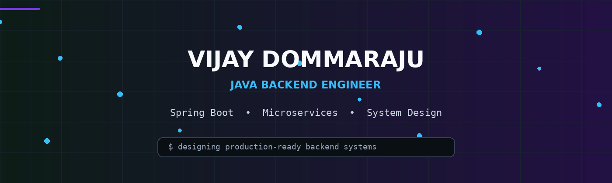

<div align="center">



[](https://github.com/VijayDommaraju)
[](https://www.linkedin.com/in/vijayvarmand/)
[](mailto:vijaydommaraju111@gmail.com)

</div>

---

## 👋 Welcome Spartans

I'm **Vijay Dommaraju**, a **Java Backend Engineer** focused on building secure, scalable, maintainable and production-ready backend systems.

My core stack is **Java, Spring Boot, Spring Security, JPA/Hibernate and MySQL**, with a growing focus on **Redis, Kafka, Docker, microservices, distributed systems, performance and system design**.

I enjoy going beyond individual endpoints — understanding **architecture, transactions, concurrency, caching, messaging, reliability, observability and deployment**.

---

## 🚀 Expertise

| | |
|---|---|
| 💻 **Backend Development** | Building robust REST APIs and scalable backend services with Java and Spring Boot. |
| 🔐 **Security** | Authentication, authorization, JWT, role-based access control and secure API design. |
| 🗄️ **Database Design** | Relational database design, JPA/Hibernate, query optimization and transaction management. |
| 🌐 **Distributed Systems** | Microservices, messaging, caching and designing resilient backend architectures. |
| ⚡ **Performance** | Caching strategies, efficient queries, concurrency and backend performance optimization. |
| 🏗️ **System Design** | Designing maintainable, scalable and reliable production-oriented systems. |

---

## 🛠️ Tech Stack

<div align="center">


</div>

---

## 🌐 Socials

<div align="center">

[](https://www.linkedin.com/in/vijayvarmand/)
[](https://github.com/VijayDommaraju)
[](mailto:vijaydommaraju111@gmail.com)

</div>

---

## 🧠 Engineering Mindset

```text
Requirement
    ↓
Architecture
    ↓
API Design
    ↓
Business Logic
    ↓
Database Design
    ↓
Security
    ↓
Caching / Messaging
    ↓
Testing
    ↓
Deployment
    ↓
Monitoring
    ↓
Optimization
```

---

## 🎯 What I'm Building Toward

> From writing backend features → to engineering production systems.

```text
Code
  ↓
Design
  ↓
Scale
  ↓
Secure
  ↓
Observe
  ↓
Optimize
  ↓
Operate
```

---

<div align="center">

### ⚡ BUILD • UNDERSTAND • OPTIMIZE • SCALE

</div>
